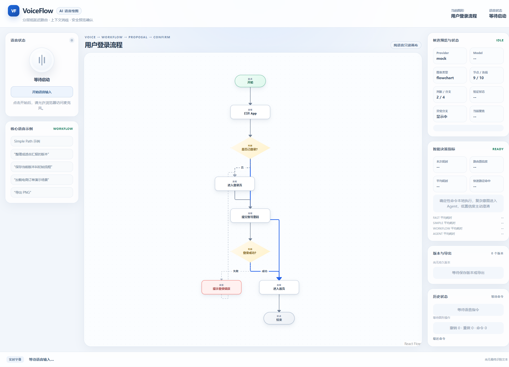

# VoiceFlow：纯语音 AI 绘图工具

VoiceFlow 面向比赛题目“AI 语音绘图工具”，用户授权浏览器麦克风后，可以不使用鼠标、键盘或触摸编辑，通过语音完成流程图、用例图、组织结构图、架构图、思维导图、数据流图、框架图和表格结构的创建、修改、排版、美化、版本管理与导出。

语音层持续消费 ASR 的 interim/final 结果，在用户连续说话时识别语义断句并生成严格有序的任务队列。边界明确、低风险的队首任务可以边听边执行；复杂任务等待本轮录音结束，任何后续简单任务都不能越过前面的任务。

界面采用左侧四分之一语音工作区与右侧四分之三画布区。工作区依次展示麦克风与字幕、自动居中滚动的任务队列，以及仅由用户明确语音保存的版本库。系统不会自动把操作快照收录进版本库。



页面默认不监听麦克风。点击“开始语音输入”后开始持续识别，完成后点击“停止语音输入”立即关闭监听。

## 核心创新

### 分层低延迟路由

```text
语音输入
  -> Fast Path：撤销、保存、导出、缩放等常用命令本地直通
  -> Simple Path：确定性的节点与连线操作
  -> Workflow Path：版本、主题、场景和视图工作流
  -> Local Planner：完整结构图本地规划与 ELK 排版
  -> Agent Path：无法确定的上下文修改
```

系统不会让所有命令都等待 AI。确定性命令直接本地执行，界面实时展示执行路径、路由置信度、本次耗时、各路径平均耗时和 Fast Path 命中率。

### 本地低延迟 ASR 校准

语音校准不调用 AI，也不发起网络请求。系统使用可扩展的多来源词典，综合内置绘图词汇、命令别名、常见错词、拼音混淆、编辑距离、当前画布节点/连线和最近命令生成候选。候选经过加权排序、最佳/次佳差值门槛和重叠冲突消解后才会替换，避免词典扩大后误改未知业务词。

当前内置基线包含 106 个规范词、51 个别名、19 条高精度错词规则和 71 组常见同音混淆，并使用 `pinyin-pro` 为任意中文业务词生成完整拼音。运行时词典会自动加入当前图标题、所有节点、连线标签和最近命令，因此不受内置词表数量上限约束。

### 通用结构图本地规划

完整新图生成不依赖模型猜测图形类型。系统先从语音确定图表类型、主题与显式组件，再生成紧凑节点关系蓝图，由本地校验器补全 ID、主题和元数据，最后交给开源 `ELK` 与 `React Flow` 完成布局和渲染。模型只处理无法由规则确定的上下文修改，避免“要求用例图却生成无关流程图”。

### 确定性执行

系统不再通过反问、候选预览或确认流程阻塞语音任务。目标存在多个候选时，按本地相关性排序选择最佳匹配；完整结构图、工作流和 AI 修改在校验通过后直接应用。无法执行的命令会明确报错，但不会阻塞后续语音。

## 题目要求映射

| 题目要求           | VoiceFlow 实现                                    |
| ------------------ | ------------------------------------------------- |
| 纯语音绘图         | 只读 React Flow 画布，绘图操作统一由语音命令驱动  |
| 指令理解准确与容错 | 本地 ASR 校准、当前画布上下文匹配、确定性最佳匹配 |
| 降低语音到绘图延迟 | 四级路由、Fast Path 本地直通、实时延迟指标        |
| 复杂指令拆解与执行 | Agent 输出经过校验的 Operation 批次并直接提交     |
| 可恢复与安全       | 撤销/重做、持久版本、运行时 Diagram 校验          |

## 真实 AI 配置

完整结构图生成、本地校准与确定性编辑无需配置 AI。只有无法由本地规则确定的上下文修改需要真实 OpenAI-compatible Provider：

```bash
copy .env.example .env.local
npm install
npm run dev
```

请在 `.env.local` 中填写 `VITE_AI_BASE_URL`、`VITE_AI_API_KEY` 和 `VITE_AI_MODEL`。未配置时，Fast、Simple、Workflow 和本地语音校准仍可使用；Agent 请求会明确提示真实 AI 尚未配置。浏览器中的 `VITE_` 配置仅适合本地演示，生产环境应使用后端代理。

## 推荐语音命令

- Fast Path：`撤销`、`重做`、`保存`、`导出 SVG`、`看全图`
- 本地语音校准：`声成一张强化学西的流成图`
- 确定性修改：`把失败分支改成红色虚线`
- 通用结构图：`画一个学生选课用例图`、`画一个公司的组织结构图`、`做一个方案对比表格`
- Workflow：`整理成适合汇报的版本`、`保存当前版本叫修改完成`

## 工程质量

- Diagram JSON 是唯一绘图数据源，组件不直接修改图表。
- AI 输出、Operation 和持久化版本进入状态前均经过运行时校验。
- React Flow 画布延迟加载，保持首屏主包体积可控。
- GitHub Actions 自动执行完整质量检查。

```bash
npm run typecheck
npm run lint
npm run format:check
npm test
npm run build
```

更多内容见 [ARCHITECTURE.md](ARCHITECTURE.md)、[DEMO_SCRIPT.md](DEMO_SCRIPT.md) 和 [DESIGN_AUDIT.md](DESIGN_AUDIT.md)。
